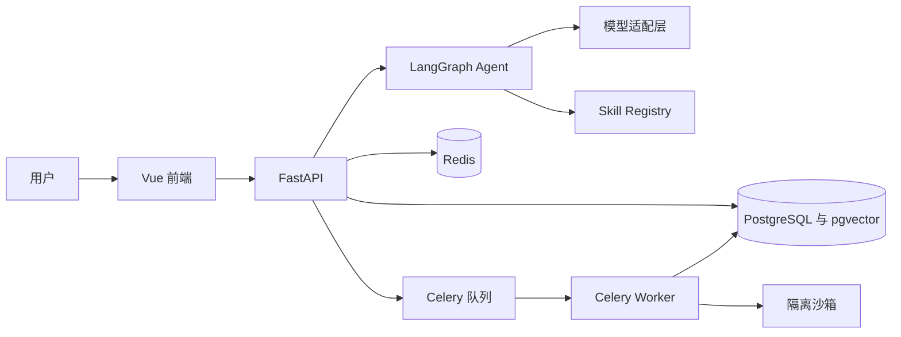

# SAT Agent System

SAT Agent System 是面向人工智能与软件开发学习者的个人学习和项目开发智能体。项目采用 FastAPI、Vue 3、LangGraph、PostgreSQL、pgvector、Redis 与 Celery 构建，目标是提供可持续记忆、任务规划、知识检索、安全工具调用和完整执行追踪。

当前版本已经完成全部十四个阶段，包含功能实现、安全执行、可观测性、自动化评测、生产部署和求职交付材料。

## 当前可用能力

1. FastAPI 应用与健康检查接口。
2. Vue 3、TypeScript、Vite、Pinia、Vue Router 和 Element Plus 基础应用。
3. PostgreSQL 与 pgvector 初始化。
4. Redis 缓存和 Celery 队列基础配置。
5. 独立沙箱镜像的资源与权限基线。
6. Docker Compose 一键启动编排。
7. 后端基础测试与前端类型检查配置。
8. 用户注册、登录、JWT、Argon2 密码摘要和资料读取。
9. 登录注册页面、会话级令牌保存、受保护路由和退出登录。
10. 统一成功响应、统一错误响应和请求参数错误脱敏。
11. 用户隔离的聊天会话创建、列表、详情与删除。
12. 用户消息和助手消息持久化、顺序维护与会话自动命名。
13. OpenAI 兼容接口的 SSE 流式输出基础能力。
14. 助手消息停止生成、失败状态和重新生成。
15. Vue 聊天页面、会话侧栏、Markdown 与代码高亮展示。
16. 模型配置缺失、连接失败和超时的安全错误提示。
17. OpenAI 兼容接口、Ollama 和自定义兼容接口统一接入。
18. chat、stream_chat、embedding、structured_output 和 tool_call 五项统一能力。
19. 模型超时、指数退避重试、备用提供商和备用模型。
20. Token 用量、可配置费用估算、调用耗时和脱敏请求日志。
21. 模型状态接口、概览页配置状态和聊天消息生成元数据。
22. 包含会话、记忆、任务、技能、风险、错误和执行元数据的 AgentState。
23. input_guard 至 trace_writer 的十二节点 LangGraph 状态图。
24. 输入拦截、技能选择、人工中断、结果校验和反思重试条件路由。
25. 本地 SQLite 检查点、线程重载、删除和跨服务实例恢复。
26. 受用户隔离保护的 Agent 线程详情、恢复和删除接口。
27. 聊天 SSE 接入 Agent 节点事件、模型 Token 流和可恢复线程标识。
28. 中断恢复次数持久化、重复恢复冲突保护和 SQLite 连接及时释放。
29. 统一 BaseSkill、输入输出 Schema、风险、超时、版本和确认契约。
30. 包扫描自动发现并注册十六个独立 Skills。
31. 参数校验、超时归一化、禁用保护和结构化执行结果。
32. 用户级 Skill 启停状态与重启后数据库恢复。
33. skills 与 skill_executions 数据表、执行耗时、输入输出、错误和重试审计。
34. Skill 列表、详情、启停、直接执行和最近记录接口。
35. LangGraph skill_executor 接入真实 Skill Registry 与执行审计。
36. Vue 技能库展示已安装技能、功能简介、分类、状态、Schema、风险、超时和调用记录，并提供新增技能模板与自动注册说明。
37. 用户隔离的知识库文档上传、列表、详情、重新向量化和删除接口。
38. PDF、DOCX、TXT、Markdown、HTML、Python、JSON 和 CSV 八类文档解析。
39. 文本清洗、章节与页码提取、可配置分片长度和重叠长度。
40. 统一模型 Embedding 与本地哈希向量自动降级。
41. PostgreSQL pgvector 原生向量列与 SQLite JSON 向量兼容存储。
42. BM25 关键词评分、余弦向量评分和 RRF 混合融合。
43. 查询覆盖率、标题相关度和精确命中的二次重排。
44. rag_search Skill 真实检索、检索失败处理和资料上下文组装。
45. RAG 提示词注入防护、资料编号引用和聊天消息引用持久化。
46. Vue 知识库页面支持上传、索引状态、分片查看、删除和检索测试。
47. 聊天页面展示文档名称、页码或章节、引用片段与相关度来源。
48. 0006 Alembic 迁移创建 documents 与 document_chunks 数据表和全文索引。
49. 会话记忆保存最近消息、引用、生成元数据和最近执行状态。
50. memories 表保存长期记忆与任务记忆、语义向量、重要度、置信度和敏感等级。
51. 0007 Alembic 迁移创建记忆表、用户索引、过期索引和全文索引。
52. 记忆写入前通过模型判断长期价值、用户相关性、敏感信息和保存类型。
53. 模型不可用时使用可测试的安全规则完成记忆判断降级。
54. 自动写入前执行向量相似去重，避免反复保存相同信息。
55. 记忆语义搜索融合 pgvector、关键词覆盖率、重要度和置信度。
56. 自动过滤过期、归档和受限敏感记忆，更新访问次数和最近访问时间。
57. 任务记忆支持保存计划、步骤、工具结果、错误和任务状态覆盖更新。
58. load_context 自动检索当前问题相关记忆，memory_writer 自动判断并保存候选信息。
59. save_memory、search_memory 和 delete_memory 已替换为真实实现。
60. 记忆接口支持列表、创建、编辑、删除和语义搜索，并按用户严格隔离。
61. Vue 长期记忆页面支持保存、搜索、编辑、归档、恢复和删除。
62. tasks 与 task_steps 保存父子任务、依赖、优先级、状态、进度和步骤执行历史。
63. 任务状态机支持待处理、规划、待确认、执行、暂停、完成、失败和取消八种状态。
64. 依赖未完成时阻止任务和步骤启动，步骤完成度自动回写任务进度。
65. 任务创建支持手工步骤、自动四阶段规划和父子任务拆分。
66. create_task、query_tasks 和 update_task 已替换为真实持久化实现。
67. 任务接口支持创建、查询、更新、暂停、继续、取消和步骤状态更新。
68. Vue 任务看板支持状态分栏、筛选、详情、依赖、子任务和执行历史操作。
69. 支持上传 ZIP 代码仓库并执行路径、符号链接、加密条目和解压体积安全校验。
70. 自动识别目录结构、语言占比、依赖、框架、项目入口、接口路由和数据库对象。
71. 自动统计测试文件与测试代码，检查疑似凭证、动态执行、Shell 调用和未完成标记。
72. analyze_repository、inspect_code 和 generate_project_report 已替换为真实实现。
73. 仓库接口支持上传、列表、详情、重新分析、代码检查、报告读取和删除。
74. Vue 仓库分析页支持指标、语言、技术栈、文件、接口、依赖、风险和 Markdown 报告展示。
75. 人工确认决定、参数摘要、决定人和决定时间持久化。
76. pytest 命令白名单、Docker 一次性隔离执行和日志回传。
77. 沙箱关闭网络、只读运行并限制 CPU、内存、进程数和超时。
78. Agent Trace 保存节点时间线、状态摘要、错误、重试和恢复次数。
79. 模型调用日志保存提供商、模型、Token、延迟、费用和脱敏摘要。
80. Vue Trace 页面展示运行概况、提供商分布和执行详情。
81. core_v1 提供六十条、十二类 Agent 评测样本。
82. 十二项指标覆盖能力、安全、工具、记忆、引用和性能。
83. 评测结果持久化并支持 JSON、CSV 和 ECharts 展示。
84. CI 自动执行后端测试、覆盖率门槛、前端测试、构建和 Compose 校验。
85. 生产覆盖配置提供资源限制、安全选项和日志轮转。
86. 提供备份恢复脚本、演示素材、演示流程、简历描述和面试问答。

## 系统架构



## 技术栈

1. 后端使用 Python 3.12、FastAPI、SQLAlchemy、Alembic、Pydantic、LangChain、LangGraph 和 Celery。
2. 数据层使用 PostgreSQL、pgvector 与 Redis。
3. 前端使用 Vue 3、TypeScript、Vite、Vue Router、Pinia、Element Plus、Axios、Markdown It 与 ECharts。
4. 交付使用 Docker、Docker Compose 与 Nginx。
5. 测试使用 pytest、Vitest 和 Vue Test Utils。

## 目录说明

1. backend 保存 FastAPI 应用、数据库迁移、后台任务和后端测试。
2. backend/app/api 保存版本化接口路由。
3. backend/app/core 保存配置、日志和应用级基础设施。
4. backend/app/db 保存数据库会话、基类和持久化辅助代码。
5. backend/app/workers 保存 Celery 应用和异步任务。
6. backend/alembic 保存数据库迁移环境与版本脚本。
7. backend/tests 保存单元测试和接口测试。
8. frontend 保存 Vue 3 单页应用和 Nginx 配置。
9. frontend/src/api 保存统一 HTTP 客户端。
10. frontend/src/router 保存页面路由。
11. frontend/src/stores 保存 Pinia 状态。
12. frontend/src/views 保存系统概览、认证、聊天、Skills 和知识库业务页面。
13. sandbox 保存安全执行 Python 测试所需的隔离镜像。
14. deploy 保存 PostgreSQL 初始化等部署资源。
15. docs 保存总体计划、架构、Agent、RAG、数据库、接口、部署和评测文档。
16. evaluation 保存六十条评测数据、运行脚本和导出结果。
17. demo 保存知识库文档和代码仓库演示素材。
18. storage 保存上传文件与沙箱任务数据，运行数据不会提交到版本库。
19. compose.yaml 编排前端、后端、Worker、PostgreSQL、Redis 和沙箱服务。
20. .env.example 与 .env.production.example 提供环境变量模板。


## 环境准备

1. 安装 Docker Desktop，并确认 Docker Compose 可用。
2. 复制环境变量文件。

```powershell
Copy-Item .env.example .env
```

3. 修改 .env 中的应用密钥、数据库密码和模型配置。生产环境需要使用独立随机密钥。

## 启动方式

```powershell
docker compose up --build
```

启动完成后访问 http://localhost:5173。后端 OpenAPI 页面位于 http://localhost:8000/docs。

### 无 Docker 本地启动

后端窗口直接执行以下命令。本地开发会自动创建或升级 storage/sat_agent_dev.db，并生成当前进程有效的随机 JWT 密钥。

```powershell
Set-Location "D:\桌面\找工作实习\SAT Agent System\backend"
..\.venv\Scripts\python.exe -m uvicorn app.main:app
```

前端窗口执行以下命令。

```powershell
Set-Location "D:\桌面\找工作实习\SAT Agent System\frontend"
npm.cmd run dev
```

访问 http://localhost:5173，页面会先进入登录注册入口。

如果注册失败，页面会直接显示具体原因。无法连接后端时会提示启动后端；数据库异常时会提示重启和初始化；重复用户名与邮箱会显示对应冲突信息。

## 健康检查

```powershell
Invoke-RestMethod http://localhost:8000/health
Invoke-RestMethod http://localhost:8000/ready
```

health 表示进程存活。ready 会同时检查 PostgreSQL 和 Redis。

## 模型配置

模型参数集中放在 .env。当前支持 OpenAI 兼容接口、Ollama 和自定义兼容接口。MODEL_API_KEY 留空时，聊天页会显示明确配置提示。完整配置见 docs/model_providers.md。

## 数据库初始化

PostgreSQL 容器首次启动时会创建 vector 扩展。后端容器启动时执行 alembic upgrade head。当前迁移链为 0001 至 0007，包含 pgvector、用户、聊天、Skills、Skill 执行审计、知识库文档、向量分片和三层记忆。

## 使用示例

注册并登录后可以进入聊天页。首次发送消息会自动创建会话并保存用户消息。配置 MODEL_API_KEY、MODEL_BASE_URL 和 CHAT_MODEL_NAME 后，助手回答通过 SSE 持续写入页面与数据库。停止生成和重新生成可以直接从聊天页操作。

## Agent 工作流程

当前工作流包含输入防护、上下文加载、意图路由、规划、技能选择、技能执行、结果校验、反思、人工确认、回答生成、记忆写入与轨迹写入。详细设计位于 docs/agent_design.md。

## RAG 工作流程

当前流程包含上传、类型识别、解析、清洗、元数据提取、切分、向量化、pgvector 存储、BM25 关键词检索、余弦向量检索、RRF 混合排序、重排、上下文组装和引用回答。Embedding 模型未配置时使用 local-hash-v1，配置后自动通过 ModelService 调用外部模型。详细设计位于 docs/rag_design.md。

## 记忆工作流程

会话记忆来自当前会话最近十二条消息和执行元数据。load_context 根据当前问题检索长期记忆与任务记忆，回答节点使用经过敏感过滤的相关上下文。memory_writer 在回答后判断用户输入的长期价值、相关性、敏感性和重复性，再决定是否写入。详细设计位于 docs/memory_design.md。

## Skills 扩展方式

系统已经提供统一 BaseSkill 与 SkillRegistry。每个 Skill 使用独立模块，声明输入模型、输出模型、风险等级、超时和执行方法。访问 /skills 可以查看和管理当前用户的技能。详细约定位于 docs/skill_development.md。

## 测试命令

```powershell
docker compose run --rm backend pytest
docker compose run --rm frontend npm run test
```

本地开发环境也可以执行以下命令。

```powershell
.\.venv\Scripts\python.exe -m pytest backend --cov=app
Set-Location frontend
npm run build
npm run test
```

## 评测命令

评测模块提供 core_v1 六十条 JSONL 样本、十二项指标、真实 Agent 批量执行、数据库结果、JSON 与 CSV 导出和 ECharts 页面。命令行运行示例为 python evaluation/scripts/run_evaluation.py --username student --dataset core_v1。

