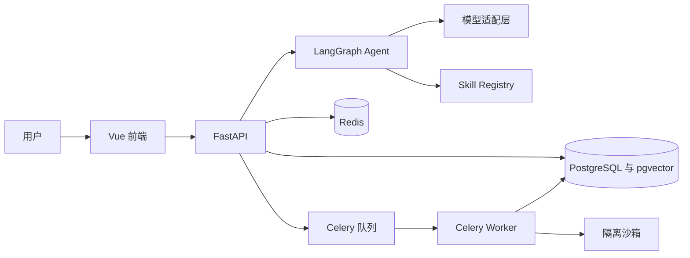

# SAT Agent System

SAT Agent System 是面向人工智能与软件开发学习者的个人学习和项目开发智能体。项目采用 FastAPI、Vue 3、LangGraph、PostgreSQL、pgvector、Redis 与 Celery 构建，目标是提供可持续记忆、任务规划、知识检索、安全工具调用和完整执行追踪。

当前版本已经完成全部十四个阶段，包含功能实现、安全执行、可观测性、自动化评测、生产部署和求职交付材料。

## 当前可用能力

1. FastAPI 应用与健康检查接口。
2. Vue 3、TypeScript、Vite、Pinia、Vue Router 和 Element Plus 基础应用。
3. PostgreSQL 与 pgvector 初始化。
4. Redis 缓存和 Celery 队列基础配置。
5. 独立沙箱镜像的资源与权限基线。
6. Docker Compose 一键启动编排。
7. 后端基础测试与前端类型检查配置。
8. 用户注册、登录、JWT、Argon2 密码摘要和资料读取。
9. 登录注册页面、会话级令牌保存、受保护路由和退出登录。
10. 统一成功响应、统一错误响应和请求参数错误脱敏。
11. 用户隔离的聊天会话创建、列表、详情与删除。
12. 用户消息和助手消息持久化、顺序维护与会话自动命名。
13. OpenAI 兼容接口的 SSE 流式输出基础能力。
14. 助手消息停止生成、失败状态和重新生成。
15. Vue 聊天页面、会话侧栏、Markdown 与代码高亮展示。
16. 模型配置缺失、连接失败和超时的安全错误提示。
17. OpenAI 兼容接口、Ollama 和自定义兼容接口统一接入。
18. chat、stream_chat、embedding、structured_output 和 tool_call 五项统一能力。
19. 模型超时、指数退避重试、备用提供商和备用模型。
20. Token 用量、可配置费用估算、调用耗时和脱敏请求日志。
21. 模型状态接口、概览页配置状态和聊天消息生成元数据。
22. 包含会话、记忆、任务、技能、风险、错误和执行元数据的 AgentState。
23. input_guard 至 trace_writer 的十二节点 LangGraph 状态图。
24. 输入拦截、技能选择、人工中断、结果校验和反思重试条件路由。
25. 本地 SQLite 检查点、线程重载、删除和跨服务实例恢复。
26. 受用户隔离保护的 Agent 线程详情、恢复和删除接口。
27. 聊天 SSE 接入 Agent 节点事件、模型 Token 流和可恢复线程标识。
28. 中断恢复次数持久化、重复恢复冲突保护和 SQLite 连接及时释放。
29. 统一 BaseSkill、输入输出 Schema、风险、超时、版本和确认契约。
30. 包扫描自动发现并注册十六个独立 Skills。
31. 参数校验、超时归一化、禁用保护和结构化执行结果。
32. 用户级 Skill 启停状态与重启后数据库恢复。
33. skills 与 skill_executions 数据表、执行耗时、输入输出、错误和重试审计。
34. Skill 列表、详情、启停、直接执行和最近记录接口。
35. LangGraph skill_executor 接入真实 Skill Registry 与执行审计。
36. Vue 技能库展示已安装技能、功能简介、分类、状态、Schema、风险、超时和调用记录，并提供新增技能模板与自动注册说明。
37. 用户隔离的知识库文档上传、列表、详情、重新向量化和删除接口。
38. PDF、DOCX、TXT、Markdown、HTML、Python、JSON 和 CSV 八类文档解析。
39. 文本清洗、章节与页码提取、可配置分片长度和重叠长度。
40. 统一模型 Embedding 与本地哈希向量自动降级。
41. PostgreSQL pgvector 原生向量列与 SQLite JSON 向量兼容存储。
42. BM25 关键词评分、余弦向量评分和 RRF 混合融合。
43. 查询覆盖率、标题相关度和精确命中的二次重排。
44. rag_search Skill 真实检索、检索失败处理和资料上下文组装。
45. RAG 提示词注入防护、资料编号引用和聊天消息引用持久化。
46. Vue 知识库页面支持上传、索引状态、分片查看、删除和检索测试。
47. 聊天页面展示文档名称、页码或章节、引用片段与相关度来源。
48. 0006 Alembic 迁移创建 documents 与 document_chunks 数据表和全文索引。
49. 会话记忆保存最近消息、引用、生成元数据和最近执行状态。
50. memories 表保存长期记忆与任务记忆、语义向量、重要度、置信度和敏感等级。
51. 0007 Alembic 迁移创建记忆表、用户索引、过期索引和全文索引。
52. 记忆写入前通过模型判断长期价值、用户相关性、敏感信息和保存类型。
53. 模型不可用时使用可测试的安全规则完成记忆判断降级。
54. 自动写入前执行向量相似去重，避免反复保存相同信息。
55. 记忆语义搜索融合 pgvector、关键词覆盖率、重要度和置信度。
56. 自动过滤过期、归档和受限敏感记忆，更新访问次数和最近访问时间。
57. 任务记忆支持保存计划、步骤、工具结果、错误和任务状态覆盖更新。
58. load_context 自动检索当前问题相关记忆，memory_writer 自动判断并保存候选信息。
59. save_memory、search_memory 和 delete_memory 已替换为真实实现。
60. 记忆接口支持列表、创建、编辑、删除和语义搜索，并按用户严格隔离。
61. Vue 长期记忆页面支持保存、搜索、编辑、归档、恢复和删除。
62. tasks 与 task_steps 保存父子任务、依赖、优先级、状态、进度和步骤执行历史。
63. 任务状态机支持待处理、规划、待确认、执行、暂停、完成、失败和取消八种状态。
64. 依赖未完成时阻止任务和步骤启动，步骤完成度自动回写任务进度。
65. 任务创建支持手工步骤、自动四阶段规划和父子任务拆分。
66. create_task、query_tasks 和 update_task 已替换为真实持久化实现。
67. 任务接口支持创建、查询、更新、暂停、继续、取消和步骤状态更新。
68. Vue 任务看板支持状态分栏、筛选、详情、依赖、子任务和执行历史操作。
69. 支持上传 ZIP 代码仓库并执行路径、符号链接、加密条目和解压体积安全校验。
70. 自动识别目录结构、语言占比、依赖、框架、项目入口、接口路由和数据库对象。
71. 自动统计测试文件与测试代码，检查疑似凭证、动态执行、Shell 调用和未完成标记。
72. analyze_repository、inspect_code 和 generate_project_report 已替换为真实实现。
73. 仓库接口支持上传、列表、详情、重新分析、代码检查、报告读取和删除。
74. Vue 仓库分析页支持指标、语言、技术栈、文件、接口、依赖、风险和 Markdown 报告展示。
75. 人工确认决定、参数摘要、决定人和决定时间持久化。
76. pytest 命令白名单、Docker 一次性隔离执行和日志回传。
77. 沙箱关闭网络、只读运行并限制 CPU、内存、进程数和超时。
78. Agent Trace 保存节点时间线、状态摘要、错误、重试和恢复次数。
79. 模型调用日志保存提供商、模型、Token、延迟、费用和脱敏摘要。
80. Vue Trace 页面展示运行概况、提供商分布和执行详情。
81. core_v1 提供六十条、十二类 Agent 评测样本。
82. 十二项指标覆盖能力、安全、工具、记忆、引用和性能。
83. 评测结果持久化并支持 JSON、CSV 和 ECharts 展示。
84. CI 自动执行后端测试、覆盖率门槛、前端测试、构建和 Compose 校验。
85. 生产覆盖配置提供资源限制、安全选项和日志轮转。
86. 提供备份恢复脚本、演示素材、演示流程、简历描述和面试问答。

## 系统架构



## 技术栈

1. 后端使用 Python 3.12、FastAPI、SQLAlchemy、Alembic、Pydantic、LangChain、LangGraph 和 Celery。
2. 数据层使用 PostgreSQL、pgvector 与 Redis。
3. 前端使用 Vue 3、TypeScript、Vite、Vue Router、Pinia、Element Plus、Axios、Markdown It 与 ECharts。
4. 交付使用 Docker、Docker Compose 与 Nginx。
5. 测试使用 pytest、Vitest 和 Vue Test Utils。

## 目录说明

1. backend 保存 FastAPI 应用、数据库迁移、后台任务和后端测试。
2. backend/app/api 保存版本化接口路由。
3. backend/app/core 保存配置、日志和应用级基础设施。
4. backend/app/db 保存数据库会话、基类和持久化辅助代码。
5. backend/app/workers 保存 Celery 应用和异步任务。
6. backend/alembic 保存数据库迁移环境与版本脚本。
7. backend/tests 保存单元测试和接口测试。
8. frontend 保存 Vue 3 单页应用和 Nginx 配置。
9. frontend/src/api 保存统一 HTTP 客户端。
10. frontend/src/router 保存页面路由。
11. frontend/src/stores 保存 Pinia 状态。
12. frontend/src/views 保存系统概览、认证、聊天、Skills 和知识库业务页面。
13. sandbox 保存安全执行 Python 测试所需的隔离镜像。
14. deploy 保存 PostgreSQL 初始化等部署资源。
15. docs 保存总体计划、架构、Agent、RAG、数据库、接口、部署和评测文档。
16. evaluation 保存六十条评测数据、运行脚本和导出结果。
17. demo 保存知识库文档和代码仓库演示素材。
18. storage 保存上传文件与沙箱任务数据，运行数据不会提交到版本库。
19. compose.yaml 编排前端、后端、Worker、PostgreSQL、Redis 和沙箱服务。
20. .env.example 与 .env.production.example 提供环境变量模板。

## 第一阶段文件说明

1. compose.yaml 定义 frontend、backend、worker、postgres、redis 和 sandbox 六项服务及其健康检查、依赖和数据卷。
2. .env.example 列出应用、数据库、Redis、JWT、模型、RAG、沙箱和日志环境变量。
3. .gitignore 排除本地密钥、虚拟环境、依赖、构建产物、测试产物和运行数据。
4. backend/pyproject.toml 声明 Python 包、运行依赖、测试依赖、pytest 和覆盖率配置。
5. backend/Dockerfile 构建非 root 用户运行的 FastAPI 与 Celery 共用镜像。
6. backend/.dockerignore 排除后端容器构建不需要的缓存和测试产物。
7. backend/alembic.ini 配置 Alembic 路径和迁移日志。
8. backend/alembic/env.py 连接同步迁移引擎，并加载 SQLAlchemy 元数据。
9. backend/alembic/script.py.mako 定义迁移文件模板。
10. backend/alembic/versions/20260618_0001_enable_vector.py 创建 pgvector 扩展基线迁移。
11. backend/scripts/start.py 在容器启动时执行迁移并启动 Uvicorn。
12. backend/app/main.py 创建 FastAPI、CORS、生命周期、路由、health 和 ready 接口。
13. backend/app/core/config.py 集中读取和校验环境变量。
14. backend/app/core/logging.py 配置 JSON 日志和敏感字段隐藏。
15. backend/app/core/redis.py 实现 Redis 就绪探测。
16. backend/app/db/base.py 提供 SQLAlchemy 声明基类。
17. backend/app/db/session.py 提供异步引擎、会话依赖、数据库探测和连接关闭。
18. backend/app/api/v1/router.py 汇总第一版业务路由。
19. backend/app/api/v1/system.py 返回系统名称、环境、接口版本和开发阶段。
20. backend/app/workers/celery_app.py 配置 Celery Broker、结果后端、序列化和 Worker 行为。
21. backend/app/workers/health_tasks.py 提供 Worker 连通性任务。
22. backend/tests/test_health.py 验证进程健康、系统信息、依赖就绪和依赖故障响应。
23. backend/tests/test_worker.py 验证 Celery 基础任务。
24. frontend/package.json 声明 Vue 运行依赖、开发依赖与构建测试命令。
25. frontend/package-lock.json 锁定前端依赖版本和完整性摘要。
26. frontend/tsconfig.json 组织浏览器与 Node TypeScript 项目引用。
27. frontend/tsconfig.app.json 配置 Vue 应用严格类型检查和路径别名。
28. frontend/tsconfig.node.json 配置 Vite 与 Vitest 的 Node 类型环境。
29. frontend/vite.config.ts 配置 Vue 插件、路径别名、开发端口和接口代理。
30. frontend/vitest.config.ts 配置组件测试、jsdom 和路径别名。
31. frontend/env.d.ts 引入 Vite 客户端类型。
32. frontend/index.html 提供单页应用挂载入口和页面元数据。
33. frontend/Dockerfile 使用 Node 构建应用，并通过 Nginx 提供生产静态服务。frontend/nginx.conf 将上传请求上限设置为二十五 MB，以覆盖默认二十 MB 的知识库文件限制。
34. frontend/.dockerignore 排除前端依赖和构建产物，缩小构建上下文。
35. frontend/nginx.conf 处理单页路由、业务接口代理、健康接口代理和后续 SSE 长连接。
36. frontend/src/main.ts 安装 Pinia、Vue Router、Element Plus 和全局样式。
37. frontend/src/App.vue 提供根路由出口。
38. frontend/src/router/index.ts 定义系统概览页面路由。
39. frontend/src/api/http.ts 提供统一 Axios 客户端和错误传播入口。
40. frontend/src/api/system.ts 定义系统状态类型，并适配 ready 的降级响应。
41. frontend/src/stores/system.ts 管理系统信息、依赖状态、加载状态和错误状态。
42. frontend/src/views/SystemOverviewView.vue 展示项目名称、基础服务和开发路线。
43. frontend/src/views/SystemOverviewView.test.ts 验证系统概览组件的关键内容。
44. frontend/src/assets/main.css 定义桌面与移动端响应式视觉样式。
45. sandbox/Dockerfile 创建非 root、可由 Compose 收紧权限的 Python 沙箱基础镜像。
46. sandbox/runner/idle.py 保持第一阶段沙箱容器存活，并正确处理停止信号。
47. deploy/postgres/init.sql 在 PostgreSQL 首次启动时启用 pgvector。
48. docs/implementation_plan.md 保存阶段顺序、目标目录、核心数据模型和 LangGraph 流程。
49. docs/architecture.md 说明服务边界和接口入口。
50. docs/agent_design.md 说明状态图、持久化、确认和重试原则。
51. docs/rag_design.md 说明用户隔离、混合检索、重排和提示词注入防护。
52. docs/skill_development.md 说明 Skill 统一接口和自动注册约定。
53. docs/database_design.md 说明数据库、迁移和用户隔离原则。
54. docs/api_documentation.md 说明接口前缀和当前开放接口。
55. docs/deployment.md 说明 Compose 启动和生产部署注意事项。
56. docs/evaluation.md 说明评测数据覆盖范围和结果格式。
57. docs/phase_1_report.md 保存第一阶段交付、测试结果、验证边界和下一阶段入口。
58. evaluation 保存六十条评测数据、十二项指标、批量执行脚本和 JSON、CSV 结果。
59. storage/.gitkeep 保留运行存储目录，上传内容与沙箱任务数据由 .gitignore 排除。
60. 项目进度、流程及提示词/项目开发流程.txt 保存连续阶段进度，方便下一轮开发直接恢复上下文。

## 第二阶段新增文件说明

1. backend/app/models/base.py 定义所有业务模型共享的创建时间和更新时间字段。
2. backend/app/models/user.py 定义用户账号、密码摘要、状态、画像和登录时间。
3. backend/app/models/__init__.py 集中导出模型并触发 Alembic 元数据注册。
4. backend/app/schemas/common.py 定义统一成功响应与错误响应结构。
5. backend/app/schemas/auth.py 定义注册、登录、公开用户和访问令牌数据契约。
6. backend/app/security/password.py 使用 Argon2 完成密码摘要和安全验证。
7. backend/app/security/tokens.py 创建并校验带过期时间、类型和唯一标识的 JWT。
8. backend/app/services/auth.py 实现账号规范化、重复检测、用户创建和身份校验。
9. backend/app/api/dependencies.py 从 Bearer 令牌解析当前用户并检查账号状态。
10. backend/app/api/v1/auth.py 提供注册、登录和资料接口。
11. backend/alembic/versions/20260618_0002_create_users.py 创建 users 表和唯一索引。
12. backend/scripts/init_dev_db.py 为无 Docker 的本地开发环境初始化 SQLite 表。
13. backend/tests/conftest.py 提供隔离的异步 SQLite 数据库和 API 客户端。
14. backend/tests/test_auth_api.py 验证注册、登录、输入校验、禁用账号、鉴权和双用户隔离。
15. backend/tests/test_security.py 验证 Argon2 盐值、密码校验、JWT 往返和密钥缺失保护。
16. frontend/src/types/api.ts 定义前后端统一响应类型。
17. frontend/src/api/auth.ts 封装注册、登录和资料读取接口。
18. frontend/src/stores/auth.ts 管理访问令牌、当前用户、恢复会话和退出登录。
19. frontend/src/views/auth/AuthView.vue 提供响应式登录注册页面和错误展示。
20. frontend/src/views/auth/AuthView.test.ts 验证认证页面关键入口。
21. docs/phase_2_report.md 保存第二阶段实现、验收结果和下一阶段入口。
22. backend/alembic/versions/20260618_0003_make_user_email_optional.py 将已有用户表的邮箱字段迁移为可空。

注册规则：用户名和密码必须填写。邮箱与显示名称可以留空。注册失败时，页面会显示缺少字段、格式错误、重复用户名、重复邮箱或后端连接失败等具体原因。

## 第三阶段新增文件说明

1. backend/app/models/chat.py 定义 chat_sessions 与 chat_messages 数据模型、用户索引、会话内消息顺序和父消息关系。
2. backend/app/schemas/chat.py 定义会话、消息、发送消息和会话详情的数据契约。
3. backend/app/services/chat.py 实现会话管理、消息持久化、历史组装、停止生成和重新生成。
4. backend/app/services/chat_generation.py 实现 OpenAI 兼容端点的基础流式客户端和安全错误转换。
5. backend/app/agent/prompts/chat.py 保存第三阶段基础聊天系统提示词。
6. backend/app/api/v1/chat.py 提供会话、消息、SSE、停止和重新生成接口。
7. backend/alembic/versions/20260618_0004_create_chat_tables.py 创建聊天会话和消息表。
8. backend/tests/test_chat_api.py 验证会话增删查、用户隔离、消息持久化、SSE、停止和重新生成。
9. backend/tests/test_chat_generation.py 验证模型配置、兼容流解析、上游状态码和超时处理。
10. frontend/src/api/chat.ts 封装聊天接口并解析浏览器 SSE 响应。
11. frontend/src/stores/chat.ts 管理会话列表、当前消息、流式状态、停止和重新生成。
12. frontend/src/views/chat/ChatView.vue 提供完整聊天工作区。
13. frontend/src/components/MarkdownContent.vue 安全渲染 Markdown 和代码高亮。
14. frontend/src/api/chat.test.ts 验证 SSE 客户端和结构化错误。
15. frontend/src/stores/chat.test.ts 验证聊天状态流转。
16. frontend/src/views/chat/ChatView.test.ts 验证聊天页面展示、发送和停止入口。
17. frontend/src/components/MarkdownContent.test.ts 验证 Markdown 展示和原始 HTML 隔离。
18. docs/phase_3_report.md 保存第三阶段交付、测试结果、验收边界和下一阶段入口。

## 第四阶段新增文件说明

1. backend/app/providers/types.py 定义消息、选项、Token、工具、流式事件、响应和调用元数据契约。
2. backend/app/providers/errors.py 定义安全、可分类和可判断重试的模型异常。
3. backend/app/providers/base.py 定义统一 ModelProvider 接口。
4. backend/app/providers/openai_compatible.py 实现 OpenAI 与自定义兼容协议。
5. backend/app/providers/ollama.py 实现 Ollama 聊天、流式聊天、向量、结构化输出和工具调用。
6. backend/app/providers/registry.py 注册并按名称读取模型提供商。
7. backend/app/providers/service.py 实现统一默认参数、重试、备用提供商、费用估算和脱敏日志。
8. backend/app/api/v1/models.py 提供不包含密钥的模型状态接口。
9. backend/app/schemas/model.py 定义模型状态公开响应。
10. backend/tests/test_model_providers.py 验证三类协议和五项统一能力。
11. backend/tests/test_model_service.py 验证重试、备用模型、流式安全边界和费用估算。
12. backend/tests/test_models_api.py 验证状态接口鉴权和密钥隔离。
13. docs/model_providers.md 说明提供商、环境变量、备用模型和费用配置。
14. docs/phase_4_report.md 保存第四阶段交付和验收记录。

## 第五阶段新增文件说明

1. backend/app/agent/state.py 定义完整 AgentState 和初始状态工厂。
2. backend/app/agent/nodes 定义输入防护、上下文加载、规划、执行、响应和记录节点。
3. backend/app/agent/routing 定义五项条件路由。
4. backend/app/agent/graph/builder.py 构建十二节点 LangGraph。
5. backend/app/agent/checkpoint.py 实现可持久化 SQLite 检查点。
6. backend/app/agent/service.py 提供执行、流式事件、状态读取、恢复和删除能力。
7. backend/app/schemas/agent.py 定义 Agent 线程和恢复请求数据契约。
8. backend/app/api/v1/agent.py 提供线程详情、恢复和删除接口，并校验用户所有权。
9. backend/app/services/chat_generation.py 将聊天生成切换到 Agent 图编排。
10. backend/tests/test_agent.py 覆盖状态、节点、路由、检查点、恢复和删除。
11. backend/tests/test_agent_api.py 覆盖恢复接口、重复恢复冲突和用户隔离。
12. docs/phase_5_report.md 保存第五阶段交付与验收记录。

## 第六阶段新增文件说明

1. backend/app/skills/base.py 定义 BaseSkill、SkillContext 和 SkillMetadata。
2. backend/app/skills/registry.py 实现包扫描、自动注册、查询和用户级启停覆盖。
3. backend/app/skills/executor.py 实现参数校验、超时、错误归一化和审计回调。
4. backend/app/skills/contracts.py 定义通用输入输出和执行结果契约。
5. backend/app/skills/builtin 下十六个独立模块实现全部基础 Skill 定义。
6. backend/app/models/skill.py 定义 skills 与 skill_executions 数据模型。
7. backend/alembic/versions/20260619_0005_create_skill_tables.py 创建技能和执行审计表。
8. backend/app/services/skills.py 实现定义同步、启停持久化、执行记录和 Agent 审计。
9. backend/app/api/v1/skills.py 提供 Skill 管理和直接执行接口。
10. backend/app/schemas/skill.py 定义 Skill API 数据契约。
11. backend/app/agent/nodes/execution.py 将图内执行接入 SkillExecutor。
12. frontend/src/api/skills.ts 和 frontend/src/stores/skills.ts 提供 Skills 前端数据层。
13. frontend/src/views/skills/SkillsView.vue 提供技能管理与调用记录页面。
14. backend/tests/test_skills.py 和 backend/tests/test_skills_api.py 覆盖第六阶段核心能力。
15. docs/phase_6_report.md 保存第六阶段交付与验收记录。

## 第七阶段新增文件说明

1. backend/app/models/knowledge.py 定义文档与文档分片模型，PostgreSQL 使用 pgvector，SQLite 使用 JSON 兼容列。
2. backend/alembic/versions/20260619_0006_create_knowledge_tables.py 创建 documents、document_chunks、用户索引和全文索引。
3. backend/app/rag/types.py 定义解析段落、分片草稿和检索命中的内部数据结构。
4. backend/app/rag/text.py 实现文本清洗、中英文检索词提取、关键词统计和 Token 估算。
5. backend/app/rag/parsers.py 实现八类文件识别、编码检测、解析和元数据提取。
6. backend/app/rag/chunker.py 实现按段落与句子边界切分以及可配置重叠。
7. backend/app/rag/embeddings.py 接入统一模型 Embedding，并提供本地可复现向量降级。
8. backend/app/services/knowledge.py 实现文件存储、索引生命周期、BM25、pgvector、RRF、重排和上下文组装。
9. backend/app/schemas/knowledge.py 定义文档、分片和检索接口契约。
10. backend/app/api/v1/knowledge.py 提供上传、列表、详情、删除、重新索引和检索接口。
11. backend/app/skills/builtin/rag_search.py 将 rag_search 升级为真实知识库检索 Skill。
12. backend/app/agent/nodes/response.py 将 RAG 上下文、引用和提示词注入防护接入回答生成。
13. frontend/src/api/knowledge.ts 与 frontend/src/stores/knowledge.ts 提供知识库前端数据层。
14. frontend/src/views/knowledge/KnowledgeView.vue 提供知识库管理和测试检索页面。
15. frontend/src/views/knowledge/KnowledgeView.test.ts 验证文档列表和混合检索展示。
16. backend/tests/test_knowledge.py 验证八类解析基础、PDF 文本提取、切分、索引、检索、重建、删除和用户隔离。
17. docs/phase_7_report.md 保存第七阶段交付与验收记录。

## 第八阶段新增文件说明

1. backend/app/models/memory.py 定义长期记忆与任务记忆模型和 pgvector 方言兼容列。
2. backend/alembic/versions/20260619_0007_create_memories.py 创建 memories 表和相关索引。
3. backend/app/memory/types.py 定义语义检索命中结构。
4. backend/app/memory/decision.py 实现模型判断、规则降级、敏感检测和自动捕获。
5. backend/app/services/memories.py 实现记忆增删改查、过期、去重、语义检索和任务记忆更新。
6. backend/app/agent/nodes/memory.py 实现相关记忆加载和回答后自动写入节点。
7. backend/app/schemas/memory.py 定义记忆接口输入输出契约。
8. backend/app/api/v1/memories.py 提供记忆列表、创建、更新、删除和搜索接口。
9. backend/app/skills/builtin/save_memory.py 实现经过判断和去重的真实记忆保存 Skill。
10. backend/app/skills/builtin/search_memory.py 实现真实语义记忆检索 Skill。
11. backend/app/skills/builtin/delete_memory.py 实现用户隔离的真实记忆删除 Skill。
12. frontend/src/api/memories.ts 与 frontend/src/stores/memories.ts 提供记忆前端数据层。
13. frontend/src/views/memories/MemoriesView.vue 提供长期记忆管理和语义搜索页面。
14. frontend/src/views/memories/MemoriesView.test.ts 验证记忆列表与语义结果展示。
15. backend/tests/test_memories.py 覆盖模型判断、敏感拦截、过期、检索、任务记忆、Agent 节点、Skills 和用户隔离。
16. docs/memory_design.md 说明三层记忆、判断、检索、安全和生命周期设计。
17. docs/phase_8_report.md 保存第八阶段交付与验收记录。

## 第九阶段新增文件说明

1. backend/app/models/task.py 定义任务、父子关系和步骤执行记录模型。
2. backend/alembic/versions/20260619_0008_create_tasks.py 创建 tasks、task_steps 和相关索引。
3. backend/app/schemas/task.py 定义任务创建、更新、详情与步骤契约。
4. backend/app/services/tasks.py 实现拆分、依赖校验、状态机、进度联动和任务记忆同步。
5. backend/app/api/v1/tasks.py 提供任务与步骤接口。
6. backend/app/skills/builtin/create_task.py 实现真实任务创建与自动拆分。
7. backend/app/skills/builtin/query_tasks.py 实现真实任务筛选查询。
8. backend/app/skills/builtin/update_task.py 实现真实状态、进度和优先级更新。
9. frontend/src/api/tasks.ts 与 frontend/src/stores/tasks.ts 提供任务前端数据层。
10. frontend/src/views/tasks/TasksView.vue 提供任务看板和执行历史页面。
11. backend/tests/test_tasks.py 验证任务状态机、依赖、拆分、接口、Skills 和用户隔离。
12. frontend/src/views/tasks/TasksView.test.ts 验证看板展示和详情加载。
13. docs/task_design.md 说明任务模型、状态、依赖和进度设计。
14. docs/phase_9_report.md 保存第九阶段交付与验收记录。

## 第十阶段新增文件说明

1. backend/app/models/repository.py 定义代码仓库、文件分析和项目报告模型。
2. backend/alembic/versions/20260620_0009_create_repositories.py 创建仓库分析表与索引。
3. backend/app/schemas/repository.py 定义仓库详情、报告和代码检查契约。
4. backend/app/services/repositories.py 实现 ZIP 安全解压、静态分析、风险规则和报告生成。
5. backend/app/api/v1/repositories.py 提供仓库上传、查询、分析、检查、报告和删除接口。
6. backend/app/skills/builtin/analyze_repository.py 实现真实仓库分析 Skill。
7. backend/app/skills/builtin/inspect_code.py 实现真实文件静态检查 Skill。
8. backend/app/skills/builtin/generate_project_report.py 实现真实项目报告 Skill。
9. frontend/src/api/repositories.ts 与 frontend/src/stores/repositories.ts 提供仓库前端数据层。
10. frontend/src/views/repositories/RepositoriesView.vue 提供仓库上传与分析页面。
11. backend/tests/test_repositories.py 验证安全解压、分析、接口、Skills 和用户隔离。
12. frontend/src/views/repositories/RepositoriesView.test.ts 验证仓库指标与分析结果展示。
13. docs/repository_analysis_design.md 说明安全边界、检测能力和报告结构。
14. docs/phase_10_report.md 保存第十阶段交付与验收记录。

## 环境准备

1. 安装 Docker Desktop，并确认 Docker Compose 可用。
2. 复制环境变量文件。

```powershell
Copy-Item .env.example .env
```

3. 修改 .env 中的应用密钥、数据库密码和模型配置。生产环境需要使用独立随机密钥。

## 启动方式

```powershell
docker compose up --build
```

启动完成后访问 http://localhost:5173。后端 OpenAPI 页面位于 http://localhost:8000/docs。

### 无 Docker 本地启动

后端窗口直接执行以下命令。本地开发会自动创建或升级 storage/sat_agent_dev.db，并生成当前进程有效的随机 JWT 密钥。

```powershell
Set-Location "D:\桌面\找工作实习\SAT Agent System\backend"
..\.venv\Scripts\python.exe -m uvicorn app.main:app
```

前端窗口执行以下命令。

```powershell
Set-Location "D:\桌面\找工作实习\SAT Agent System\frontend"
npm.cmd run dev
```

访问 http://localhost:5173，页面会先进入登录注册入口。

如果注册失败，页面会直接显示具体原因。无法连接后端时会提示启动后端；数据库异常时会提示重启和初始化；重复用户名与邮箱会显示对应冲突信息。

## 健康检查

```powershell
Invoke-RestMethod http://localhost:8000/health
Invoke-RestMethod http://localhost:8000/ready
```

health 表示进程存活。ready 会同时检查 PostgreSQL 和 Redis。

## 模型配置

模型参数集中放在 .env。当前支持 OpenAI 兼容接口、Ollama 和自定义兼容接口。MODEL_API_KEY 留空时，聊天页会显示明确配置提示。完整配置见 docs/model_providers.md。

## 数据库初始化

PostgreSQL 容器首次启动时会创建 vector 扩展。后端容器启动时执行 alembic upgrade head。当前迁移链为 0001 至 0007，包含 pgvector、用户、聊天、Skills、Skill 执行审计、知识库文档、向量分片和三层记忆。

## 使用示例

注册并登录后可以进入聊天页。首次发送消息会自动创建会话并保存用户消息。配置 MODEL_API_KEY、MODEL_BASE_URL 和 CHAT_MODEL_NAME 后，助手回答通过 SSE 持续写入页面与数据库。停止生成和重新生成可以直接从聊天页操作。

## Agent 工作流程

当前工作流包含输入防护、上下文加载、意图路由、规划、技能选择、技能执行、结果校验、反思、人工确认、回答生成、记忆写入与轨迹写入。详细设计位于 docs/agent_design.md。

## RAG 工作流程

当前流程包含上传、类型识别、解析、清洗、元数据提取、切分、向量化、pgvector 存储、BM25 关键词检索、余弦向量检索、RRF 混合排序、重排、上下文组装和引用回答。Embedding 模型未配置时使用 local-hash-v1，配置后自动通过 ModelService 调用外部模型。详细设计位于 docs/rag_design.md。

## 记忆工作流程

会话记忆来自当前会话最近十二条消息和执行元数据。load_context 根据当前问题检索长期记忆与任务记忆，回答节点使用经过敏感过滤的相关上下文。memory_writer 在回答后判断用户输入的长期价值、相关性、敏感性和重复性，再决定是否写入。详细设计位于 docs/memory_design.md。

## Skills 扩展方式

系统已经提供统一 BaseSkill 与 SkillRegistry。每个 Skill 使用独立模块，声明输入模型、输出模型、风险等级、超时和执行方法。访问 /skills 可以查看和管理当前用户的技能。详细约定位于 docs/skill_development.md。

## 测试命令

```powershell
docker compose run --rm backend pytest
docker compose run --rm frontend npm run test
```

本地开发环境也可以执行以下命令。

```powershell
.\.venv\Scripts\python.exe -m pytest backend --cov=app
Set-Location frontend
npm run build
npm run test
```

## 评测命令

评测模块提供 core_v1 六十条 JSONL 样本、十二项指标、真实 Agent 批量执行、数据库结果、JSON 与 CSV 导出和 ECharts 页面。命令行运行示例为 python evaluation/scripts/run_evaluation.py --username student --dataset core_v1。

## 常见问题

1. ready 返回 503 时，先查看 postgres 与 redis 的健康状态。
2. 前端无法访问接口时，检查 backend 容器是否健康，并确认 Nginx 代理配置已经加载。
3. 端口冲突时，在 .env 中修改 BACKEND_PORT 与 FRONTEND_PORT。
4. 首次构建需要下载镜像和依赖，耗时取决于网络环境。

## 项目截图

docs/images/README.md 保存截图命名、页面范围和验收要求。截图必须来自真实登录会话，避免使用合成页面代替运行结果。

## 交付状态

完整十四阶段已经开发完成。生产部署、演示流程、简历描述、面试问答和最终检查清单均已纳入 docs。

## 阶段验证记录

第一阶段记录见 docs/phase_1_report.md。第二阶段认证与安全验证见 docs/phase_2_report.md。第三阶段聊天与流式输出验证见 docs/phase_3_report.md。第四阶段模型适配验证见 docs/phase_4_report.md。第五阶段状态图与持久化验证见 docs/phase_5_report.md。第六阶段技能系统验证见 docs/phase_6_report.md。第七阶段知识库与 RAG 验证见 docs/phase_7_report.md。第八阶段三层记忆验证见 docs/phase_8_report.md。第九阶段任务规划验证见 docs/phase_9_report.md。第十阶段仓库分析验证见 docs/phase_10_report.md。第十一阶段人工确认与隔离测试验证见 docs/phase_11_report.md。第十二阶段 Trace 与可观测性验证见 docs/phase_12_report.md。第十三阶段 Agent 评测验证见 docs/phase_13_report.md。第十四阶段最终交付验证见 docs/phase_14_report.md。
